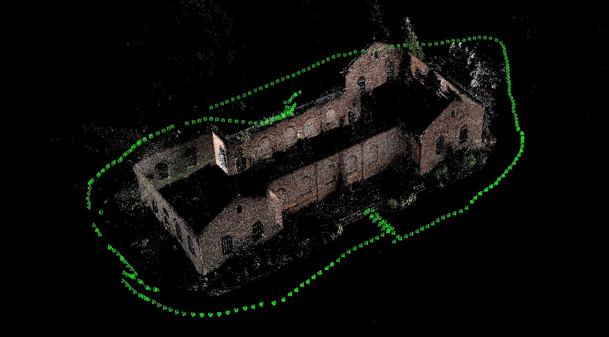
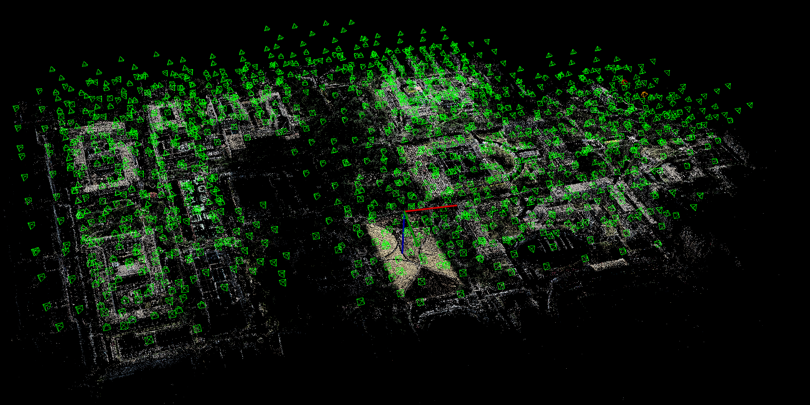
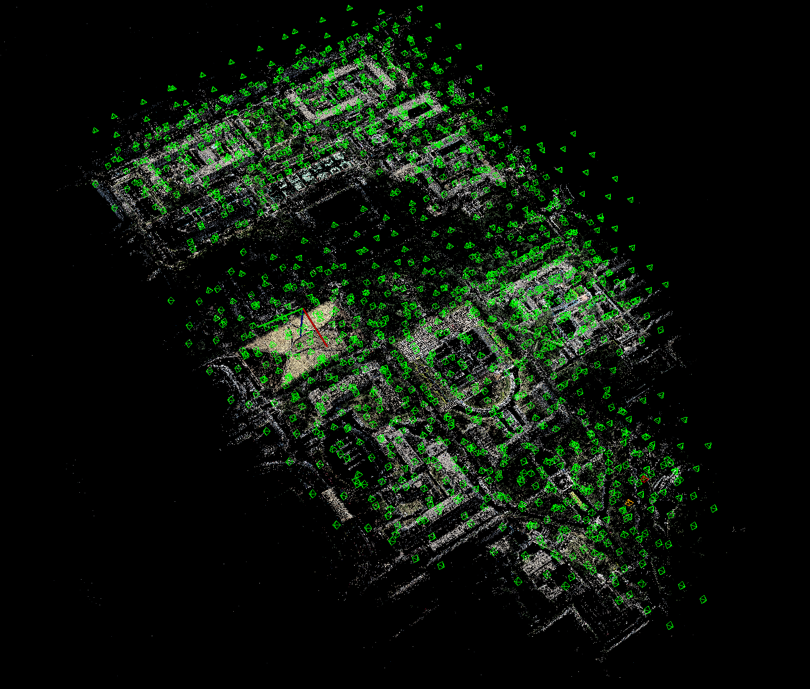

# MonocularSfM : Monocular Structure from Motion

## Introuction

MonocularSfm是一个三维重建的程序, 可以对有序或者无序的图片进行三维重建.

程序的输入是**图片**和**相机参数**(包括相机内参`fx`, `fy`, `cx`, `fy`和畸变参数`k1`, `k2`, `p1`, `p2`[可选]).

程序的输出是**三维稀疏点云**和已注册图像的**投影矩阵**.


### south-building


### person-hall


### 东北大学



Number points3D			: `542084`

Number images			: `1329`

Mean reprojection error : `0.33772 [px]`


## Dependencies
* [Eigen](http://eigen.tuxfamily.org) version 3.2
* [OpenCV](http://opencv.org) version 3.x or higher
* [Ceres](http://ceres-solver.org) version 1.10 or higher

## Building
```
mkdir build && cd build
cmake ..
make -j3
```

## How to Run
```
# step1 : 提取特征
./FeatureExtraction ../config/NEU.yaml

# step2 : 计算匹配(根据数据集的不同，决定使用**顺序匹配**或者是**暴力匹配**, 通过修改config中配置文件的参数来实现)
./ComputeMatches ../config/NEU.yaml

# step3 : 检查匹配, 通过显示不同图像之间的匹配对, 来确认前两步是否正确(可跳过).
./CheckMatches  ../config/NEU.yaml

# step4 : 重建
./Reconstruction ../config/NEU.yaml

```
更多细节，请查看`config`文件夹下的`yaml`文件

或者直接使用python脚本文件`pipeline.py`
```
./pipeline ./config/NEU.yaml
```

## Knowledge
 See the [wiki](https://github.com/nebula-beta/MonocularSfM/wiki) page

## Citations
[1] Snavely N, Seitz S M, Szeliski R. [Photo Tourism: Exploring Photo Collections In 3D](http://phototour.cs.washington.edu/Photo_Tourism.pdf)[J]. Acm Transactions on Graphics, 2006, 25(3):págs. 835-846.

[2] Wu C. [Towards Linear-Time Incremental Structure from Motion](http://ccwu.me/vsfm/vsfm.pdf)[C]// International Conference on 3d Vision. IEEE Computer Society, 2013:127-134.

[3] Schönberger J L, Frahm J M. [Structure-from-Motion Revisited](https://demuc.de/papers/schoenberger2016sfm.pdf)[C]// Computer Vision and Pattern Recognition. IEEE, 2016.
